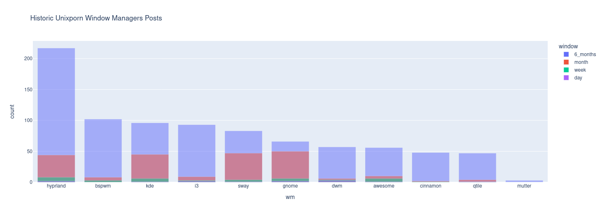

# For INST366
Pyhton script that scrapes google search results, searching for posts on 'unixporn' with certain window managers in the title, and plots the historic popularity over 1 day, 7 days, 3 months, and 1 year.
## Complaints
Google sucks and rate limits, so I was not able to get all the requests I wanted, plus I had to add an abitrary 'time.sleep(5)' to keep making requests. 
## Privacy
In order to protect user privacy during this scrape, I used a google search using searhc operators to isolate posts to reddit.com/unixporn. Then I used beautiful soup to get the amount of results that come up based on the search query. So no user data is pulled or stored, since the data of interest for this data scraping was aggregrated data. 
## Pre Generated Graph (10/16/2023)

